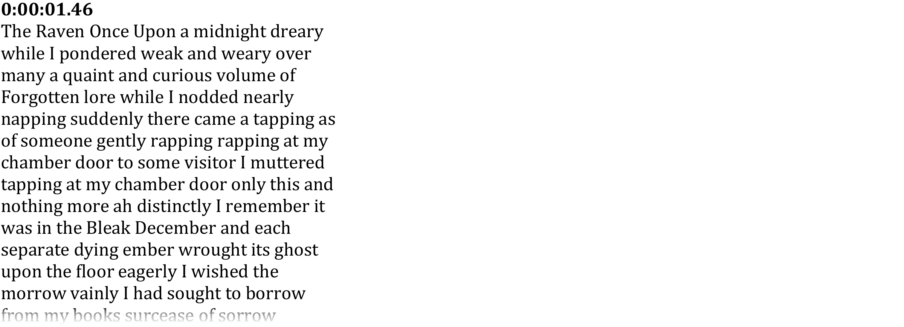

Converts YouTube automatic subtitles to a DOCX transcript.

# Requirements
Requires GNU Make, FFmpeg, Python and Pandoc.

# Usage
Use as follows:

``` sh
pip install -r requirements.txt
make BefliMlEzZ8.docx
```

The produced transcript (of Poe's [Raven], YouTube video ID `BefliMlEzZ8`) will
reside in file `BefliMlEzZ8.docx`:

 

 [raven]: https://www.youtube.com/watch?v=BefliMlEzZ8
